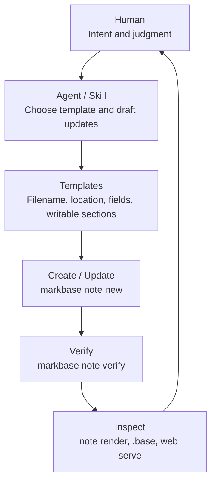

# markbase

Obsidian-compatible Markdown knowledge base infrastructure for AI agents.

中文版本：[README.zh-CN.md](README.zh-CN.md)

markbase exists for one specific workflow: keep writing notes as normal Markdown, keep the vault compatible with Obsidian, keep AI-written notes structurally consistent through templates and `note verify`, and make the vault usable from CLI tools, server-side agents, and the web without depending on the Obsidian app.

[](https://deepwiki.com/flyisland/markbase)

## Why This Exists

I built markbase around four recurring problems:

1. Obsidian has a CLI, but it depends on the desktop app being open, which makes it a poor fit for headless or server-side agent workflows.
2. Even with AI help, keeping notes structurally consistent is hard. Agents tend to "improvise" frontmatter and note layout unless the system gives them a clear contract.
3. Obsidian Base, or the community Dataview plugin, is extremely useful for showing one-to-many relationships inside notes. A company note can automatically show related people or opportunities in Obsidian, but an agent reading raw Markdown cannot see that computed view.
4. Once the vault is synced to a Linux server, you still need a simple way to inspect notes quickly in the browser.

markbase is the layer that fills those gaps.

The most important piece for consistency is its template system. Templates define the expected structure for a note, and `markbase note verify` lets agents and humans check whether notes still conform to that structure instead of slowly drifting into incompatible formats.

## Best Practice

The strongest real-world pattern is not "let the agent write arbitrary Markdown." It is "let the human provide intent, let the agent do the repetitive note work, and let markbase enforce the contract."



### Collaboration roles

| Role | Main job | Should not do |
| --- | --- | --- |
| Human | Provide intent, review edge cases, decide ambiguous cases | Hand-maintain every schema detail in every note |
| Agent | Choose a template, fill allowed sections, align entities, repair verify failures | Invent new structure or write outside template-declared surfaces |
| markbase | Expose templates, create notes in the right place, verify schema, render `.base` relationships, serve the vault | Replace human judgment or rely on unchecked free-form output |

### Recommended workflow

| Step | Who leads | What happens |
| --- | --- | --- |
| 1. Capture intent | Human | The user states what happened or what should be recorded |
| 2. Pick one template | Agent + markbase | The agent uses `markbase template list` and `markbase template describe` to choose exactly one template |
| 3. Create the note | markbase | `markbase note new` creates the file with the correct location, defaults, and structure |
| 4. Fill only allowed parts | Agent | The agent writes only fields and sections that the template explicitly allows |
| 5. Verify structure | markbase + agent | `markbase note verify` catches drift; the agent repairs if needed |
| 6. Inspect derived views | Human + agent | `.base` views, `note render`, and `web serve` expose relationships back to both sides |

This is how I use markbase in my own Obsidian vault.

- `company_customer` defines company files under `entities/company/`, requires stable fields such as `description` and `type`, constrains links like `owner -> person`, and embeds Base views for related people and activity logs.
- `person_work` defines person files under `entities/person/`, requires a linked company, and keeps relationship history in template-declared sections instead of free-form drift.
- `activity_log` defines event-style notes under `logs/opportunities/`, requires fields such as `date`, `activity_type`, and `related_customer`, and preserves attachments and attendee views in a repeatable structure.
- Domain skills such as `opportunity-capture` and `english-capture` treat templates as the source of truth for filename rules, required properties, writable sections, and post-write verification.

In practice, the template is not just a note scaffold. It is the contract that tells the agent what kind of note this is, where it lives, how it should be named, which links are valid, which sections are writable, and what must still be true after later edits. `note verify` is what turns that contract into something enforceable.

## What markbase does

- Runs as a standalone CLI. No Obsidian app is required.
- Keeps Markdown files as the source of truth and builds a rebuildable DuckDB index for fast reads.
- Stays compatible with Obsidian conventions such as wikilinks, embeds, frontmatter, and `.base` files.
- Uses templates to give notes a repeatable structure, then uses `note verify` to enforce that structure over time.
- Gives agents stable commands for querying notes, resolving links, creating notes from templates, and checking schema compliance.
- Renders embedded notes and Base views so agents can access the same derived relationships that humans see in Obsidian.
- Serves the vault over the web for quick browser access on a local machine or server.

## Use markbase if

- You want agents to work on a Markdown vault directly instead of through a proprietary database.
- You want Obsidian compatibility, especially around links, embeds, and Base-style note relationships.
- You need stronger note structure than "free-form Markdown plus vibes", especially if multiple agents or people are writing notes.
- You want a server-friendly CLI and web view for a synced vault.

## Core ideas

- Files are the product. DuckDB is only a derived index.
- Markdown note identity is name-based, not path-based.
- Obsidian-compatible behavior wins over internal abstraction when the two conflict.
- Templates plus `note verify` are the mechanism for keeping AI-written notes structurally consistent.
- Default outputs are agent-friendly. Human-readable tables are opt-in.

## Installation

From crates.io:

```bash
cargo install markbase
```

From source:

```bash
git clone <repository-url>
cd markbase
cargo build --release
./target/release/markbase --help
```

Rust 1.85+ is required. DuckDB is bundled.

## Quick Start

Set the vault directory:

```bash
export MARKBASE_BASE_DIR=/path/to/your/vault
```

Query notes:

```bash
markbase query "author == 'Tom'"
markbase query "list_contains(file.tags, 'customer')"
markbase query "SELECT file.path, note.author FROM notes WHERE note.author = 'Tom'"
```

Create a note from a template:

```bash
markbase note new acme --template company
markbase note verify acme
```

Inspect the rendered relationships that an agent would otherwise miss in raw Markdown:

```bash
markbase note render acme
markbase web serve --homepage /HOME.md
```

Serve the vault in the browser:

```bash
markbase web serve --homepage /HOME.md
markbase web serve --cache-control "public, max-age=60"
markbase web get /entities/person/alice.md  # print final web Markdown body
markbase web get /entities/person/alice.md?fields=properties,links
```

## Command Overview

| Command | Purpose |
| --- | --- |
| `query` | Query the indexed vault with expression syntax or SQL |
| `note new` | Create Markdown notes, optionally from templates |
| `note verify` | Check whether a note still matches its template schema |
| `note rename` | Rename a note and rewrite wikilinks and embeds |
| `note resolve` | Resolve entity names to existing notes for agent linking |
| `note render` | Expand note embeds and `.base` views into agent-readable output |
| `template list` | List available templates |
| `template describe` | Show normalized template content |
| `web serve` | Serve the vault in the browser |
| `web get` | Print the final web Markdown for one canonical route |

## Concepts That Matter

### Query namespaces

- `file.*` means indexed file metadata such as `file.path`, `file.name`, `file.tags`, and `file.mtime`.
- `note.*` means frontmatter fields.
- Bare fields such as `author` are shorthand for `note.author`.

Examples:

```bash
markbase query "file.mtime > '2024-01-01'"
markbase query "author == 'Tom'"
markbase query "list_contains(file.tags, 'project')"
```

### Obsidian-compatible linking

Use note names, not paths, for Markdown-note links:

```markdown
[[Acme]]
[[Zhang San]]
![[pipeline.base]]
```

For frontmatter link values, keep them as quoted Obsidian wikilinks:

```yaml
company: "[[Acme]]"
owner: "[[Zhang San]]"
```

### Templates and verification

Templates are one of markbase's main reasons to exist. They provide a repeatable structure for note creation, and `note verify` checks whether a note still conforms to its template schema after later edits by humans or agents.

That means you can let agents create and update Markdown notes without giving up consistency. Instead of hoping every prompt produces the same frontmatter shape and embedded sections, you can define the structure once in a template and continuously verify that the vault still follows it.

In the `log-notes` workflow, templates do all of the following at once:

- choose the target directory and filename convention
- define required frontmatter and allowed enums
- constrain link targets such as `company -> company` or `owner -> person`
- declare which sections are agent-writable
- preserve structural `.base` embeds that expose related notes

That is why `note verify` matters so much. It is the mechanism that catches drift after creation, not just during creation.

### Web delivery

`web serve` gives a browser-friendly view of the same vault. By default it listens on `127.0.0.1:3000`. Routes are path-based externally, while note logic inside markbase still follows Obsidian-style name-based identity.

For both exported and dynamic modes:

- requesting `/` returns `index.html`
- requesting `/index.html` returns the same docsify entry HTML
- the docsify entry HTML keeps internal `.md` and `.base` document links inside docsify
- the browser entry HTML upgrades Obsidian-style callouts, including foldable
  `[!type]+` and `[!type]-`, in the browser UI while preserving multiline body structure
- on canonical `.md` note routes, the docsify shell renders a note-only
  metadata sidebar with `Properties` and `Links` tabs
- the active sidebar panel has its own scroll container, so long `Properties`
  content does not push other tabs below the page fold
- sidebar note/base links stay inside docsify by navigating to docsify hash
  routes such as `#/entities/company/acme.md`
- docsify TOC anchor jumps such as `#/note.md?id=heading` stay in-page and do
  not turn into backend metadata requests
- `.base` pages, the shell root route, and other non-note routes do not request
  metadata sidebar data
- binary resource URLs such as images and attachments continue to resolve
  directly

By default, `web serve` returns `Cache-Control: no-store, no-cache,
must-revalidate` plus matching legacy no-cache headers on every response. Pass
`--cache-control <value>` to override that header for all responses served by
the process.

Web routing is path-based and derived from indexed `file.path`, but internal
rendering still resolves Markdown notes and `.base` targets by name. The
canonical note or resource URL is always `/<file.path>` with browser-safe
percent-encoding.

Each `web serve` request refreshes the index before route resolution and uses a
request-scoped DuckDB handle. For Markdown notes and direct `.base` targets
without query parameters, the server returns docsify/marked-renderable
Markdown rather than an HTML shell. For binary resources, it returns raw bytes
with the corresponding `Content-Type`.

Canonical Markdown note routes also support a metadata mode via `?fields=...`:

- `?fields=properties`
- `?fields=links`
- `?fields=properties,links`

In metadata mode, the same canonical `.md` route returns
`application/json; charset=utf-8` instead of Markdown. The response always
includes a `file` object and only includes the requested top-level fields
beyond that.

Metadata mode is currently supported only for canonical Markdown note routes:

- `.md?fields=...` returns JSON metadata
- `.base?fields=...` returns `400 Bad Request`
- binary resource routes with `fields` return `400 Bad Request`
- unknown query parameters, unknown field names, and malformed `fields` syntax
  return `400 Bad Request`

The server-side Markdown pipeline:

- reuses note-render semantics for recursive `![[note]]` expansion, `.base`
  expansion, soft-failure placeholders, and quote-container preservation
- rewrites `[[note]]` links to canonical path-based Markdown links
- rewrites non-Markdown `![[...]]` resource embeds to standard Markdown images
  or links
- removes `%%comment%%` from normal Markdown body content
- preserves fenced code blocks and inline code spans literally
- leaves unresolved wikilinks, unresolved resource embeds, selector-based note
  embeds, and block-target note embeds as literal source text in v1

`markbase web get <canonical-url>` prints the same payload that `web serve`
returns for the same route:

- Markdown body for ordinary `.md` and `.base` routes
- JSON metadata for `.md?fields=...`

If the canonical URL resolves to a binary resource, `web get` exits with an
explanatory failure instead of streaming bytes.

HTTP miss and bad-path behavior:

- route miss returns `404 Not Found`
- invalid percent-decoding returns `400 Bad Request`

`web init-docsify` writes a single `index.html` and is not required for normal browser use. The browser entry HTML owns frontend-only behaviors such as
internal docsify navigation adaptation, callout UI upgrades, and the note-only
metadata sidebar tabs and routing behavior while preserving the backend
Markdown and metadata contracts.

## Environment

- `MARKBASE_BASE_DIR`: vault directory. Default is the current directory.
- `MARKBASE_INDEX_LOG_LEVEL`: automatic indexing output level.
- `MARKBASE_COMPUTE_BACKLINKS`: enable backlink computation during indexing.

## Validation

For local development:

```bash
cargo build
cargo test
cargo clippy -- -D warnings
cargo fmt --check
```

## More docs

- [ARCHITECTURE.md](ARCHITECTURE.md): system map and invariants
- [AGENTS.md](AGENTS.md): repo workflow for coding agents
- [docs/design-docs/implemented/design-010-query-subsystem.md](docs/design-docs/implemented/design-010-query-subsystem.md): query behavior
- [docs/design-docs/implemented/design-011-note-creation.md](docs/design-docs/implemented/design-011-note-creation.md): note creation behavior
- [docs/design-docs/implemented/design-002-render.md](docs/design-docs/implemented/design-002-render.md): render behavior
- [docs/design-docs/implemented/design-003-web-note-view.md](docs/design-docs/implemented/design-003-web-note-view.md): web behavior

## License

MIT
