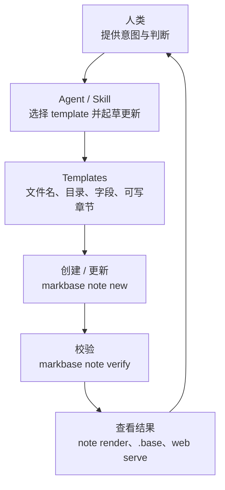

# markbase

面向 AI agent 的、兼容 Obsidian 的 Markdown 知识库基础设施。

English version: [README.md](README.md)

markbase 服务于这样一种明确的工作流：继续把笔记写成普通 Markdown，继续保持知识库与 Obsidian 兼容，同时通过 template 和 `note verify` 保持 AI 写入的结构一致性，并让整个知识库可以在不依赖 Obsidian App 的前提下，被 CLI、服务端 agent 和 web 使用。

[](https://deepwiki.com/flyisland/markbase)

## Why This Exists

我开发 markbase，主要是为了解决四类反复出现的问题：

1. Obsidian 虽然提供了 CLI，但前提是桌面 App 必须先打开，这使它并不适合无头环境或服务端 agent 工作流。
2. 即使有 AI 帮助，持续保持笔记结构一致依然很难。只要没有清晰契约，agent 就很容易在 frontmatter 和正文结构上“自由发挥”。
3. 官方的 Obsidian Base，或者社区的 Dataview 插件，都非常适合在笔记内展示一对多关系。比如客户公司笔记里可以自动展示相关人员和商机活动，但 agent 直接读取 Markdown 文件时是看不到这些派生视图的。
4. 当知识库同步到 Linux server 后，仍然需要一种简单的方法，让人或 agent 能马上通过浏览器查看笔记。

markbase 就是为填补这些空白而开发的。

其中最关键的一点，是它的 template 系统。template 定义一类笔记应该长什么样，而 `markbase note verify` 则让 agent 和人类都能持续检查这些笔记是否仍然符合结构约束，而不是随着时间慢慢漂移成互不兼容的格式。

## Best Practice

最强的实践方式不是“让 agent 随意写 Markdown”，而是“由人类提供意图，由 agent 执行重复性的笔记工作，由 markbase 负责执行结构契约”。



### 协作分工

| 角色 | 主要职责 | 不应做什么 |
| --- | --- | --- |
| 人类 | 提供意图、处理歧义、审阅边界情况 | 手工维护每篇笔记的全部 schema 细节 |
| Agent | 选择 template、填写允许的章节、对齐实体、修复 verify 失败 | 擅自发明新结构，或写入 template 未声明的区域 |
| markbase | 暴露 template、在正确位置创建笔记、校验 schema、渲染 `.base` 关系、提供 web 访问 | 取代人类判断，或依赖未经约束的自由输出 |

### 推荐工作流

| 步骤 | 主导方 | 发生什么 |
| --- | --- | --- |
| 1. 捕获意图 | 人类 | 用户说明发生了什么，或者想记录什么 |
| 2. 选择一个 template | Agent + markbase | agent 通过 `markbase template list` 和 `markbase template describe` 精确选择一个 template |
| 3. 创建笔记 | markbase | `markbase note new` 以正确的目录、默认值和结构创建文件 |
| 4. 只填写允许的部分 | Agent | agent 只写 template 明确允许填写的字段和章节 |
| 5. 校验结构 | markbase + agent | `markbase note verify` 发现结构漂移；如有问题，agent 负责修复 |
| 6. 查看派生视图 | 人类 + agent | 通过 `.base` 视图、`note render` 和 `web serve` 把关系结果再次暴露给双方 |

这是我自己在 Obsidian 知识库里使用 markbase 的方式。

- `company_customer` 用于定义 `entities/company/` 下的公司档案，要求稳定字段如 `description` 和 `type`，约束 `owner -> person` 这样的链接，并嵌入与相关人员、活动记录相关的 Base 视图。
- `person_work` 用于定义 `entities/person/` 下的人物档案，要求关联公司，并把关系历史限制在 template 声明的章节内，而不是任由内容自由漂移。
- `activity_log` 用于定义 `logs/opportunities/` 下的事件型记录，要求 `date`、`activity_type`、`related_customer` 等字段，并以统一结构保存附件和参与人视图。
- `opportunity-capture`、`english-capture` 这类 domain skill，会把 template 视为文件名规则、必填属性、可写章节和写后校验的唯一事实来源。

在这个工作流里，template 不只是“生成初稿的脚手架”，而是一个可执行的契约。它告诉 agent：这是什么笔记、应该放在哪里、文件名怎么起、哪些链接合法、哪些章节可写，以及后续修改后哪些约束仍然必须成立。`note verify` 的作用，就是把这个契约真正变成可执行、可检查的约束。

## What markbase does

- 作为独立 CLI 运行，不依赖 Obsidian App。
- 保持 Markdown 文件为事实源，并构建一个可重建的 DuckDB 索引用于快速读取。
- 兼容 Obsidian 习惯，包括 wikilink、embed、frontmatter 和 `.base` 文件。
- 通过 template 提供可重复的笔记结构，再通过 `note verify` 长期约束结构一致性。
- 为 agent 提供稳定命令，用于查询笔记、解析链接、基于 template 创建笔记以及检查 schema 合规性。
- 渲染嵌入笔记和 Base 视图，让 agent 可以读取人类在 Obsidian 中看到的那些派生关系。
- 通过 web 提供快速浏览能力，便于在本地或服务器上查看知识库。

## Use markbase if

- 你希望 agent 直接操作 Markdown 知识库，而不是一个专有数据库。
- 你需要 Obsidian 兼容性，尤其是链接、嵌入和 Base 风格的关系视图。
- 你需要比“自由 Markdown 加一点 prompt 运气”更强的结构约束，尤其是当多个人或多个 agent 都在写笔记时。
- 你希望在同步到服务器后，依然可以通过 CLI 和 web 方便访问知识库。

## Core ideas

- 文件才是产品本身，DuckDB 只是派生索引。
- Markdown 笔记的身份由名字决定，而不是路径。
- 当内部抽象和 Obsidian 兼容性冲突时，优先保证 Obsidian 行为。
- template 加 `note verify` 是保持 AI 写入结构一致性的核心机制。
- 默认输出优先面向 agent；给人看的表格是显式选择，而不是默认行为。

## Installation

从 crates.io 安装：

```bash
cargo install markbase
```

从源码构建：

```bash
git clone <repository-url>
cd markbase
cargo build --release
./target/release/markbase --help
```

需要 Rust 1.85+。DuckDB 已内置。

## Quick Start

先设置知识库目录：

```bash
export MARKBASE_BASE_DIR=/path/to/your/vault
```

查询笔记：

```bash
markbase query "author == 'Tom'"
markbase query "list_contains(file.tags, 'customer')"
markbase query "SELECT file.path, note.author FROM notes WHERE note.author = 'Tom'"
```

基于 template 创建一篇笔记：

```bash
markbase note new acme --template company
markbase note verify acme
```

查看原始 Markdown 中 agent 本来看不到的派生关系：

```bash
markbase note render acme
markbase web serve --homepage /HOME.md
```

通过浏览器访问整个知识库：

```bash
markbase web serve --homepage /HOME.md
markbase web serve --cache-control "public, max-age=60"
```

## Command Overview

| Command | Purpose |
| --- | --- |
| `query` | 使用表达式语法或 SQL 查询已索引的知识库 |
| `note new` | 创建 Markdown 笔记，可选使用 template |
| `note verify` | 检查一篇笔记是否仍然符合其 template schema |
| `note rename` | 重命名笔记并重写 wikilink 与 embed |
| `note resolve` | 为 agent 链接场景解析实体名到现有笔记 |
| `note render` | 展开 note embeds 和 `.base` 视图，输出 agent 可读内容 |
| `template list` | 列出可用 template |
| `template describe` | 查看标准化后的 template 内容 |
| `web serve` | 以浏览器可访问的方式提供知识库 |
| `web get` | 输出某个 canonical route 对应的最终 Markdown |

## Concepts That Matter

### Query namespaces

- `file.*` 表示已索引的文件元数据，例如 `file.path`、`file.name`、`file.tags`、`file.mtime`
- `note.*` 表示 frontmatter 字段
- 裸字段，例如 `author`，是 `note.author` 的简写

示例：

```bash
markbase query "file.mtime > '2024-01-01'"
markbase query "author == 'Tom'"
markbase query "list_contains(file.tags, 'project')"
```

### Obsidian-compatible linking

Markdown note 的链接请使用名字，而不是路径：

```markdown
[[Acme]]
[[Zhang San]]
![[pipeline.base]]
```

frontmatter 里的链接值请保持为带引号的 Obsidian wikilink：

```yaml
company: "[[Acme]]"
owner: "[[Zhang San]]"
```

### Templates and verification

template 是 markbase 最核心的价值之一。它负责定义一类笔记创建时的结构，而 `note verify` 则在后续被人类或 agent 多次修改后，继续检查它是否仍然符合 schema。

这意味着你可以放心让 agent 创建和更新 Markdown 笔记，而不必接受结构逐渐失控。你不需要每次都依赖 prompt 去“希望它写得一致”，而是先把结构定义在 template 里，再持续用 verify 检查整个知识库是否还遵守这个结构。

在 `log-notes` 这类实际工作流里，一个 template 往往同时定义：

- 目标目录和文件名规范
- 必填 frontmatter 和允许值
- 链接字段的目标类型约束，例如 `company -> company` 或 `owner -> person`
- 哪些章节允许 agent 写入
- 哪些 `.base` embeds 是结构的一部分，必须保留

这就是为什么 `note verify` 如此重要。它不仅仅在创建时检查结构，而是在后续长期修改中持续阻止结构漂移。

### Web delivery

`web serve` 提供一个浏览器可访问的视图。默认监听 `127.0.0.1:3000`。对外 URL 是路径式的，但 markbase 内部仍然保持基于名字的 Obsidian 风格笔记身份模型。

`markbase web get <canonical-url>` 会输出某个 canonical route 的最终 Markdown。每个 web 请求都会使用 request-scoped DuckDB handle；route miss 返回 `404 Not Found`。

`web init-docsify` 会写出一个单独的 `index.html`，但正常使用浏览器查看知识库并不依赖它。浏览器入口 HTML 会在前端升级 Obsidian-style callout，同时保持后端返回的仍然是 Markdown 契约。

## Environment

- `MARKBASE_BASE_DIR`: 知识库目录。默认是当前目录。
- `MARKBASE_INDEX_LOG_LEVEL`: 自动索引时的输出级别。
- `MARKBASE_COMPUTE_BACKLINKS`: 是否在索引时计算 backlinks。

## Validation

本地开发建议运行：

```bash
cargo build
cargo test
cargo clippy -- -D warnings
cargo fmt --check
```

## More docs

- [ARCHITECTURE.md](ARCHITECTURE.md): 系统结构图与核心不变量
- [AGENTS.md](AGENTS.md): 面向 coding agent 的仓库工作说明
- [docs/design-docs/implemented/design-010-query-subsystem.md](docs/design-docs/implemented/design-010-query-subsystem.md): query 行为
- [docs/design-docs/implemented/design-011-note-creation.md](docs/design-docs/implemented/design-011-note-creation.md): note creation 行为
- [docs/design-docs/implemented/design-002-render.md](docs/design-docs/implemented/design-002-render.md): render 行为
- [docs/design-docs/implemented/design-003-web-note-view.md](docs/design-docs/implemented/design-003-web-note-view.md): web 行为

## License

MIT
